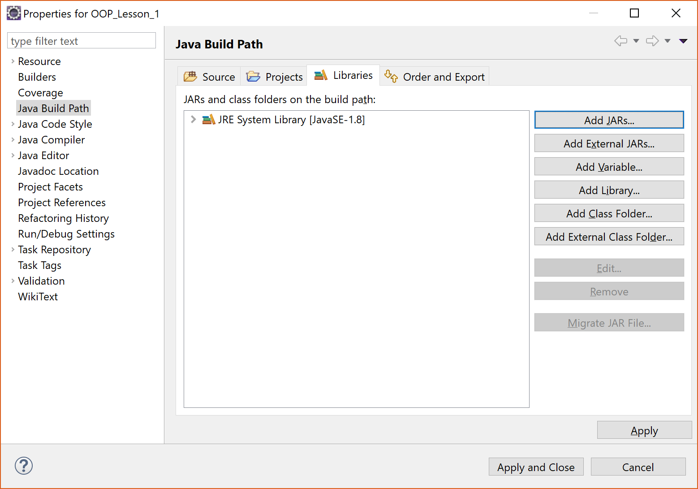

# Usefull information OOP

## Importing Jar files

### Normal import

Importing the jar file provided by the course is necessart to use the special attributes and taglets.

How to add a jar to an eclips project is explained [here](https://stackoverflow.com/a/3280384/7599890)

### Import with version control

If you are using version control the link to your external jar will probably not work on another computer. This method adds the jar with an relative link so it will not break when switching computers.

- Right-click the project folder in Eclips and select Build Path > New Source Folder


- Give the new folder a name (i.e. "lib") and click next.


- Add the pattern "*.jar" to the first section of the wizard and click finish.


- Copy the jar to the new folder you just created.
- Right-click the project folder in Eclips and select Build Path > Configure Build Path.
- Navigate to the Libraries-tab and click "Add Jars".



- Navigate to your added resource folder and select the jar.
- Done.

## Generating documentation website

Follow the next steps to generate the javadoc for your project.

- In the menubar select Project > Generate Javadoc
- If the javadoc command is not selected, configure it. (i.e. "C:\Program Files\Java\jdk1.8.0_144\bin\javadoc.exe")
- Select the project and click "Next".
- if you would like to create a link in your documentation to the online javadoc for the standard JRE classes, select the "jsse.jar" file in the list at the bottom.
- Click "Next".
- Add the following text to the text area in this section:

```Text
-taglet be.kuleuven.cs.som.taglet.InvarTaglet
-taglet be.kuleuven.cs.som.taglet.PreTaglet
-taglet be.kuleuven.cs.som.taglet.PostTaglet
-taglet be.kuleuven.cs.som.taglet.EffectTaglet
-taglet be.kuleuven.cs.som.taglet.ReturnTaglet
-taglet be.kuleuven.cs.som.taglet.ThrowsTaglet
-taglet be.kuleuven.cs.som.taglet.NoteTaglet
-tagletpath C:\path\to\AnnotationsDoclets.jar
```

- Click finish and the javadoc will be generated in the root of your project in the "doc" folder.

## AnnotationsDoclet

- Attributen
  - @Basic
  - @Immutable
  - @Model
  - @Raw
  - @Value
- Taglets
  - @Effect
  - @InVar
  - @Note
  - @OOP
  - @Post
  - @Pre
  - @Throws

Full documentation can be found [here](http://www.cs.kuleuven.be/books/OOPWithJava/doc/index.html)